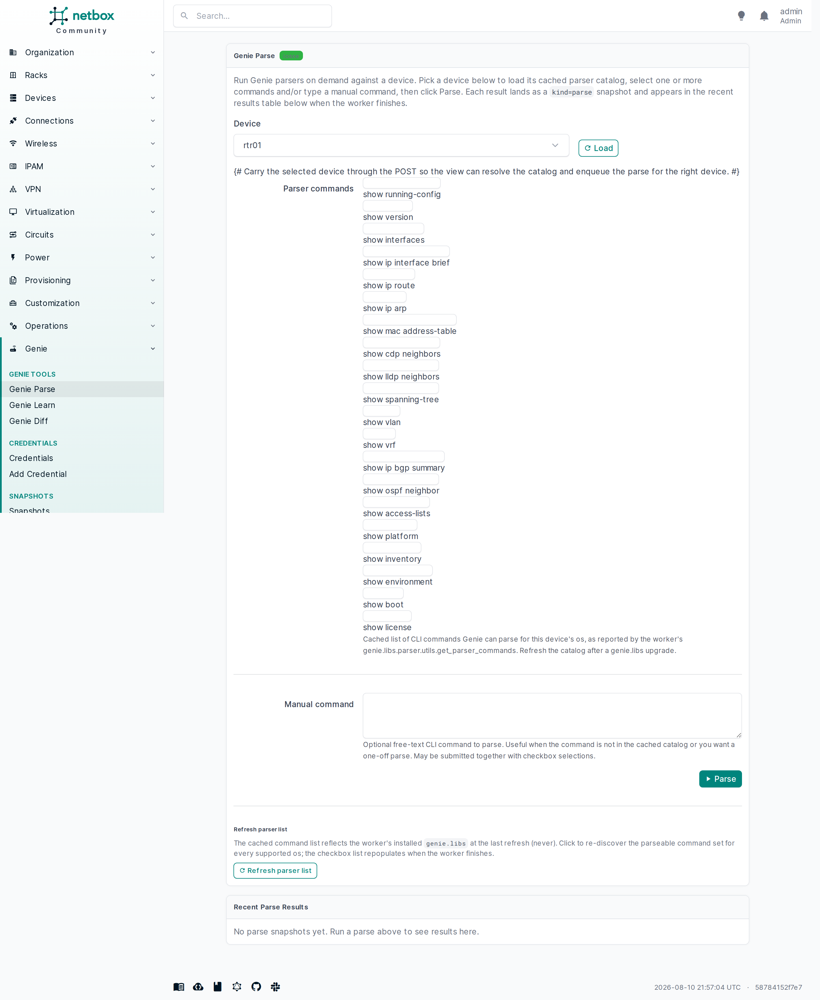
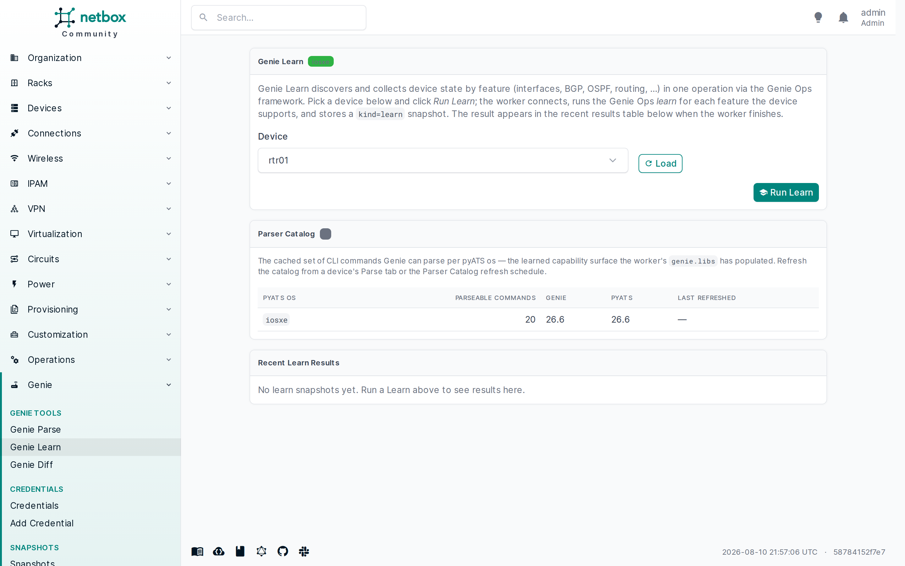
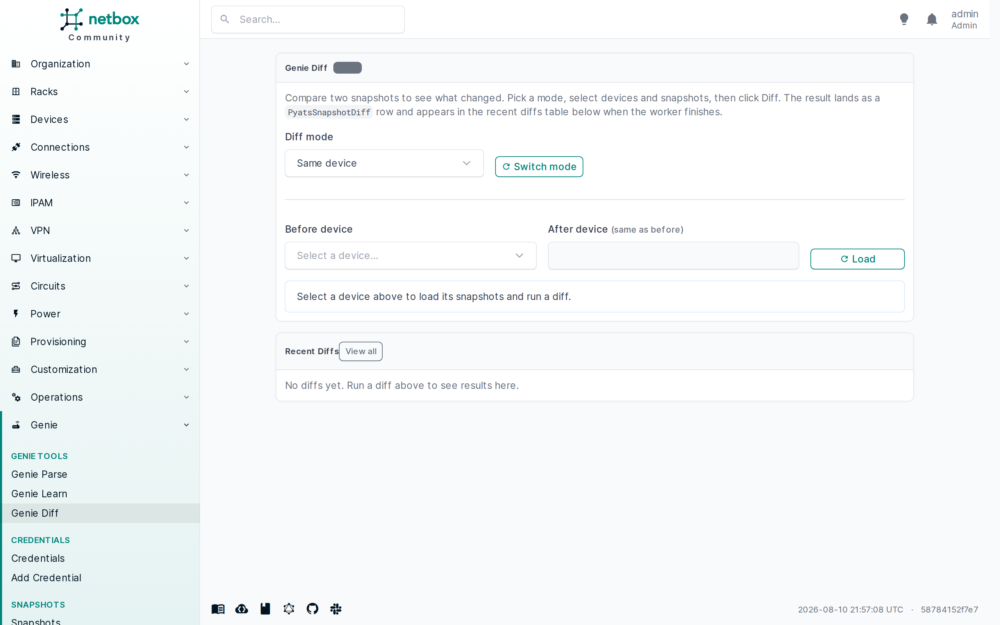

# netbox-pyats

> **⚠️ Early development — AI-built.**
> This plugin is in **very early development**, is **built purely by AI**, and has **not yet been hardened or audited**. Use it **at your own risk**, and do not deploy it against production NetBox instances without thorough review and your own validation.

An [Atw](https://github.com/openjarv) [NetBox](https://netbox.dev) plugin that brings [Cisco PyATS / Genie](https://developer.cisco.com/pyats/) into the NetBox UI — dynamic testbed building from the NetBox ORM, plugin-local encrypted credentials, device snapshots stored as JSONB, structured snapshot diffs, and config compliance (golden config vs. snapshot) from the device page.

> The plugin ships capture, diff, and compliance against real devices, with a unified jobs view and batch capture. See the [changelog](CHANGELOG.md) for the per-feature history.

## At a glance

Once installed, the plugin adds a single top-level **PyATS/Genie** entry in the NetBox navigation menu — leading with the three primary Genie tools (**Parse**, **Learn**, **Diff**) under a **Genie Tools** group, followed by the supporting groups (Credentials, Snapshots, Golden Configs & Compliance, Automation, Parser Catalog) and a closing **Jobs & Platforms** group — and every device page gains a **PyATS** tab.

<p align="center">
  &nbsp;&nbsp;
  
</p>
<p align="center"><em>Left: the single top-level PyATS/Genie menu in the NetBox nav, expanded to show all seven groups. Right: the device-page PyATS tab — capture form and recent snapshots with status badges.</em></p>

The three dedicated Genie pages — **Parse**, **Learn**, and **Diff** — are the primary surfaces for ad-hoc parser runs, Genie Ops learn captures, and snapshot diffs:

<p align="center">
  &nbsp;&nbsp;
  &nbsp;&nbsp;
  
</p>
<p align="center"><em>Left: Genie Parse. Middle: Genie Learn. Right: Genie Diff.</em></p>

The diff and compliance views render the same side-by-side before/after diff table:

<p align="center">
  &nbsp;&nbsp;
  
</p>
<p align="center"><em>Left: the snapshot diff viewer. Right: a compliance run with a <code>drift</code> result.</em></p>

## What it does

**netbox-pyats** turns your NetBox device inventory into a live PyATS testbed — no static YAML testbed to maintain. From each device's page you can capture running-config and state snapshots, diff any two snapshots, and check a captured config against a golden config for compliance. Every snapshot, diff, and compliance run is stored inside NetBox as a first-class record, so you get a permanent, queryable history for pre/post-change checks and config-compliance audits.

Three feature groups ship today — see the [usage guide](docs/user/usage.md) for the full workflow and exact UI paths:

### Capture

- **Encrypted device credentials** — plugin-local, Fernet-encrypted `PyatsCredential` model (password + enable secret); never exposed via REST, GraphQL, or the detail view.
- **Dynamic testbed from NetBox** — `build_testbed(device_qs)` maps Platform → pyATS `os`, resolves the management IP, attaches the credential, and flags unsupported platforms gracefully.
- **Snapshot capture** — `PyatsSnapshot` + `capture_snapshot` RQ job; click "Capture snapshot" on a device's PyATS tab to capture config and/or state via Genie parsers, stored as JSONB.
- **Batch capture** — bulk-action on the device list; one job → N snapshots with a `supported`/`unsupported`/`errored`/`total` summary and a `partial` status when not every device captured cleanly.
- **Supported-platforms report** — `/plugins/pyats/supported-platforms/` shows the static platform → pyATS os map with per-slug device counts.
- **Scheduled captures** — `PyatsCaptureSchedule` model + `RunCaptureSchedulesJob` NetBox `JobRunner`; define a device filter + capture kind once and let NetBox's native job scheduler fire it on a recurring interval, so you get nightly baselines for drift detection without manual triggers (see [Scheduled captures](docs/user/scheduled-captures.md)).
- **Dedicated `pyats` RQ queue + worker** — pyATS/Genie work runs on its own queue, isolated from NetBox's default workers. The default NetBox worker does not need pyATS installed; run a second worker pointed at `pyats` (see [Worker deployment](docs/user/workers.md)). Each Capture / Parse / Learn / Diff page shows a green/red **worker-status badge** so you see at a glance whether the `pyats` worker is online before you trigger a job.

### Compare

- **Snapshot diffs** — `PyatsSnapshotDiff` + `run_diff` RQ job; structured recursive diff over JSONB flattened into a server-rendered side-by-side diff table (no JS).
- **Diff viewer** — `/plugins/pyats/diffs/<pk>/`; flat `Path / Before / After` table with red/green monospace values for changed leaves, summary badges, raw-JSON fallback.
- **Genie Diff page** — `/plugins/pyats/genie/diff/`; the primary diff surface under the **PyATS/Genie → Genie Tools** group. Pick same-device or cross-device mode, select device(s) and two snapshots, and click Diff. Same-device reuses the device-page diff path; cross-device compares the same feature across two devices (the before device owns the diff row; the after device is recorded in the diff warnings). Recent diffs across all devices are shown below the form, with a "View all" link to the full diff history. The device-page Diff sub-tab stays as a convenience.
- **Genie Parse page** — `/plugins/pyats/genie/parse/`; ad-hoc Genie parser runs against any device from a first-class page — a device picker, a checkbox list of cached parser commands from the `PyatsParserCatalog`, a free-text `manual_command` field, and a recent-results table. The result lands as a `kind='parse'` snapshot.
- **Genie Learn page** — `/plugins/pyats/genie/learn/`; structured feature-state capture via the Genie Ops framework (per-feature Ops `.learn()`). Pick a device, click Run Learn, and the worker iterates every Ops feature the device exposes (BGP, interfaces, OSPF, VLANs, …) into a `kind='learn'` snapshot keyed by feature name. Learn snapshots are diffable against other `learn` snapshots in the Diff page.

### Compliance & Jobs

- **Golden configs** — `PyatsGoldenConfig` model; operator-authored expected running-config (typed or promoted from a known-good snapshot), multiple goldens per device, fully editable via REST in v1.
- **Compliance runs** — `PyatsComplianceRun` + `run_compliance` RQ job; line-by-line diff of golden vs. snapshot raw config, classified as `compliant` / `drift` / `error`.
- **Unified jobs view** — `PyatsJob` model at `/plugins/pyats/jobs/`; one row per capture / diff / compliance / batch-capture job with typed links to its result row and a `pending` → `running` → `success` / `error` / `partial` lifecycle.
- **CRUD + REST + GraphQL** for credentials, snapshots, diffs, golden configs, compliance runs, jobs, parser catalog, and capture schedules — all under `/plugins/pyats/`. See the [usage guide](docs/user/usage.md#rest-and-graphql) for the REST/GraphQL matrix.

### Device-page UI

- **Device-page "PyATS" tab** — capture button (config / state / full), recent-snapshot history with status badges, "Diff two snapshots" picker (≥2 snapshots), "Run compliance" picker (≥1 golden + ≥1 config/full snapshot), and recent-diffs / recent-compliance-runs lists.
- **Device-page "Parse" sub-tab** — `/plugins/pyats/devices/<id>/parse/`; a convenience link into the dedicated **Genie Parse** page. The checkbox list of cached parser commands (from the `PyatsParserCatalog` row for the device's resolved pyATS os — DB only, no Genie import in the web process) and the free-text `manual_command` field are shared between the two surfaces; each selected/typed command becomes one parse entry and the result lands as a `kind='parse'` snapshot in the device-page history. A "Refresh parser list" button enqueues the catalog refresh job for all supported os. See [usage guide](docs/user/usage.md#3-run-an-on-demand-parse).

## Compatibility matrix

| netbox-pyats | NetBox | Python | PostgreSQL | Redis / Valkey | pyATS |
|-------------|--------|--------|------------|----------------|-------|
| 0.1.0 (Unreleased, dev) | 4.6.x  | 3.10, 3.11, 3.12 | 15, 16, 17, 18 | Redis 6, Redis 7, Valkey 9.1 | 26.x (worker only) |

The plugin targets NetBox 4.6+ (current: 4.6.8). `pyats[full]` is **not** an install-time dependency — install it on the worker that runs snapshots only (see `pip install netbox-pyats[pyats]` or the [worker docs](docs/user/workers.md)). The NetBox web process imports the plugin without pyats installed; the diff and compliance engines are pure-Python and need no pyATS.

## Documentation

Full documentation lives under [docs/](docs/README.md) — operator guides, contributor setup, CI, ADRs, and the changelog. The quick paths:

- [Installation](docs/user/installation.md) — install, configure NetBox, first capture.
- [Usage guide](docs/user/usage.md) — the capture → diff → compliance workflow with exact UI paths.
- [PyATS worker deployment](docs/user/workers.md) — the dedicated `pyats` RQ queue (required).
- [Troubleshooting](docs/user/troubleshooting.md) — operator-facing fixes for common failure modes.
- [Scheduled captures](docs/user/scheduled-captures.md) — recurring capture schedules for nightly baselines and drift detection.

## Quick install

> **NetBox 4.6+ required.** The `pyats` worker (Step 3 below) also needs the `pyats[full]` extra installed — see [Worker deployment](docs/user/workers.md).

```bash
pip install netbox-pyats
```

Add the plugin to your NetBox configuration (`/etc/netbox/configuration.py`):

```python
PLUGINS = [
    "netbox_pyats",
]

PLUGINS_CONFIG = {
    "netbox_pyats": {
        # Recommended: a dedicated Fernet key for encrypting credential secrets.
        # Generate one with:
        #   python -c "from cryptography.fernet import Fernet; print(Fernet.generate_key().decode())"
        # If unset, the plugin derives a key from a slice of SECRET_KEY (dev only; warns).
        "credential_key": "",
        # Per-OS state-capture command override. When set, the automated
        # kind='state'/'full' capture runs these commands instead of the
        # OS-agnostic default (STATE_COMMANDS) for the matching os. Format:
        #   {"nxos": ["show version", "show vlan", "show interface"],
        #    "iosxe": ["show version", "show platform"]}
        # An os with no entry falls back to the default set. Listing an os
        # replaces (not extends) the default set for that os.
        "state_commands_per_os": {},
    },
}
```

Run database migrations and restart NetBox:

```bash
cd /opt/netbox
python manage.py migrate
sudo systemctl restart netbox netbox-rq
```

> ⚠️ **First capture needs the `pyats` worker running.** Without it the capture job sits on the `pyats` queue and the snapshot never appears — there is no error, it just never progresses. Start a worker with `python manage.py rqworker pyats` (with `pyats[full]` installed) in your NetBox worker container/service, then click Capture again. See [Worker deployment](docs/user/workers.md) for the docker form and full setup.

The full install + first-capture walkthrough (including the pyats worker setup) is in [docs/user/installation.md](docs/user/installation.md).

## Getting help

- **Bugs and feature requests:** open an issue on [the GitHub issue tracker](https://github.com/openjarv/netbox-pyats/issues).
- **Common failure modes** (unsupported platform, connection failed, stuck `pending`): see [Troubleshooting](docs/user/troubleshooting.md).

## License

Apache-2.0. See [LICENSE](LICENSE).