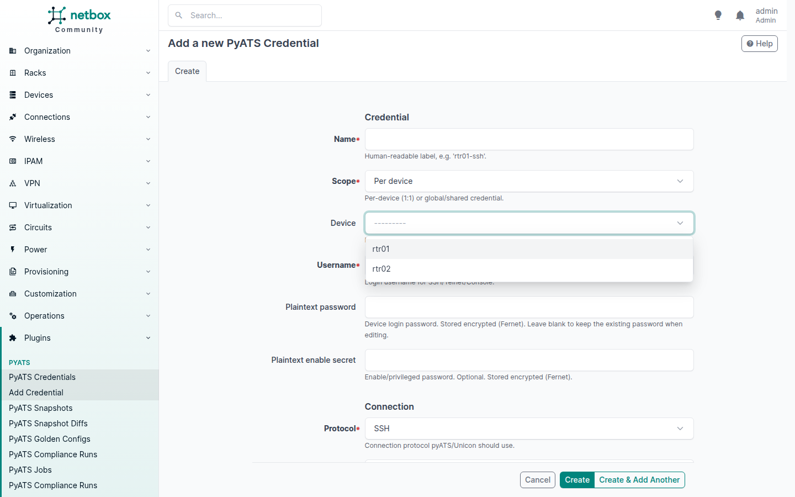
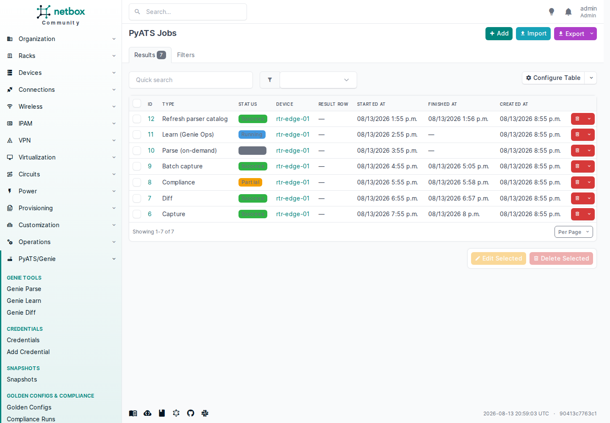
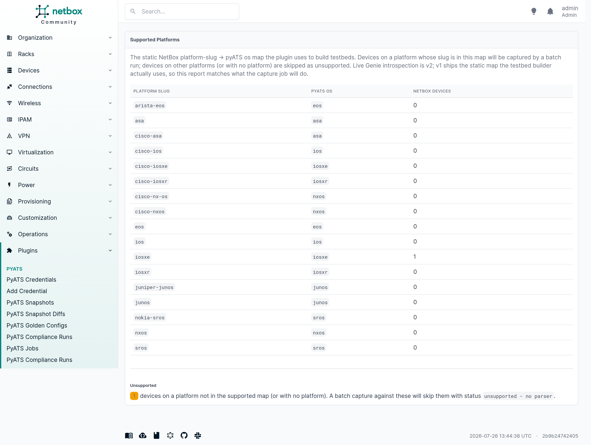

# Usage guide

The plugin adds a **PyATS** tab to every NetBox device page, plus a top-level **Genie** menu with three dedicated first-class surfaces — **Genie Parse**, **Genie Learn**, and **Genie Diff** — that are the primary way to run ad-hoc parses, Genie Ops learn captures, and snapshot diffs. The device-page tab stays as a convenience for one-device workflows; the dedicated pages are the primary surfaces for cross-device and catalog-driven work. This guide walks the full workflow with exact UI paths.

## Prerequisites

- The plugin is installed and NetBox has been restarted (see [Installation](installation.md)).
- A pyats worker is servicing the `pyats` queue (see [Worker deployment](workers.md)).
- The target device has a `PyatsCredential` record and a reachable management IP (`primary_ip4` / `primary_ip6`).
- The device's NetBox Platform slug maps to a Genie-supported os (see [Multi-vendor support](#multi-vendor-support) below).

## 1 — Add a credential

**Genie → Credentials → Add Credential**.

Pick a device, enter username + password (+ optional enable secret). The secrets are encrypted with Fernet before they hit the database — see [Credential encryption](credentials.md). The credential is never returned by the REST API, GraphQL, or the detail view template; only ciphertext is persisted.



## 2 — Capture a snapshot

Open the device's detail page → **PyATS** tab → pick a kind → **Capture**.

| Kind | What the worker runs | Stored on `data` |
|------|----------------------|-------------------|
| `config` | `device.parse('show running-config')` | `config` (Genie structured dict) + `config_raw` (raw text) |
| `state`  | a small OS-agnostic state command set via `device.parse(...)` (overridable per-os via `state_commands_per_os`) | `state` (Genie structured dict) |
| `full`   | both | `config` + `config_raw` + `state` |
| `parse`  | on-demand `device.parse(cmd)` per command (see [§3](#3-run-an-on-demand-parse)) | `state` (Genie structured dict, one key per command) |
| `learn`  | Genie Ops framework — per-feature Ops `.learn()` (see [§4](#4-run-a-genie-learn-capture)) | `learn` (`{feature: structured-dict}`) |

The job is enqueued on the `pyats` queue. When the worker finishes, the snapshot appears in the tab's recent-snapshots list with a status badge:

- `success` — capture succeeded; `data` carries the parsed payload.
- `unsupported` — the device's platform has no Genie parser; a row is still created with a warning so the device appears in the history.
- `error` — capture raised (connection, parser, etc.); a row is still created with the exception text in `parser_warnings`.

Each snapshot also carries `parsed_os` (the pyATS os string used by the capture, e.g. `iosxe` / `iosxr` / `nxos`) so future structured compliance can pick the right Genie parser even after the device row is deleted.

For recurring captures (e.g. a nightly baseline for drift detection), see [Scheduled captures](scheduled-captures.md) — you define a device filter + capture kind once and NetBox's job scheduler fires it on a cadence.


## 3 — Run an on-demand Parse

The dedicated **Genie Parse** page (**Genie → Genie Tools → Genie Parse**, `/plugins/pyats/genie/parse/`) is the primary surface for ad-hoc Genie parser runs. It combines:

- a **device picker** (GET `?device=<pk>`),
- the **parse form** — the same form the device-page Parse sub-tab uses: a checkbox list of cached parser commands for the device's resolved pyATS os (populated from the `PyatsParserCatalog` row — DB only, no Genie import in the web process) and/or a free-text `manual_command` field,
- a **recent parse results** table (`kind='parse'` snapshots across all devices).

Select commands, type a manual one, or both. The view de-duplicates (selected commands first, then the manual command) and enqueues a `parse_commands` job on the `pyats` queue. The worker runs `device.parse(cmd)` per command (raw `execute()` fallback when a command has no Genie parser — the manual text-box case), and the result lands as a `kind='parse'` `PyatsSnapshot` row in the device-page snapshot history when the worker finishes. Per-command `ParserNotFound` is recorded as a warning (graceful degradation).

A **Refresh parser list** button on the page enqueues the catalog refresh job (`refresh_parser_catalog_job`) for all supported os, repopulating the `PyatsParserCatalog` rows from the worker's Genie install. Run it once after installing or upgrading `pyats[full]` on the worker.

> **First time?** The checkbox list is empty until a worker has refreshed the parser catalog. Click **Refresh parser list** once (the worker needs `pyats[full]` installed), then reopen the Parse page.

The device-page **PyATS** tab → **Parse** link stays as a convenience; the dedicated Genie Parse page is the primary surface.


## 4 — Run a Genie Learn capture

The dedicated **Genie Learn** page (**Genie → Genie Tools → Genie Learn**, `/plugins/pyats/genie/learn/`) runs a structured feature-state capture against a device using the Genie Ops framework (per-feature Ops `.learn()`). It combines:

- a **device picker**,
- a **Run Learn** action — enqueues a `learn_snapshot_job` on the `pyats` queue; the worker connects via Unicon, iterates every Ops feature the device exposes (BGP, interfaces, OSPF, VLANs, …), and stores a `kind='learn'` `PyatsSnapshot` row whose `data["learn"]` is keyed by feature name,
- a **parser catalog** card — the cached command surface the worker's Genie install has discovered (`PyatsParserCatalog` rows); this is the "learned capability state" that backs the Parse page's checkbox list,
- a **recent learn results** table (`kind='learn'` snapshots across all devices).

Use Learn when you want a structured, feature-keyed view of device state (e.g. all BGP neighbors with their session state, all interfaces with counters) rather than the flat command list Parse produces. Learn snapshots are diffable against other `learn` snapshots in the Diff page (the picker groups by `kind`).

> **Coverage note.** The Genie Ops framework covers a bounded feature set per os (interface, BGP, OSPF, VLAN, platform, …). Features the device does not expose are skipped with a warning; an empty learn (no features discovered) lands as a `status='error'` row so it appears in the history.


## 5 — Diff two snapshots

The dedicated **Genie Diff** page (**Genie → Genie Tools → Genie Diff**, `/plugins/pyats/genie/diff/`) is the primary surface for all diff operations. It combines:

- a **mode picker** — **Same device** (classic pre/post-change check on one device) or **Cross-device** (compare the same feature across two devices),
- **device pickers** — in cross-device mode, pick the before and after devices separately (GET `?before_device=<pk>&after_device=<pk>&mode=cross`),
- a **two-snapshot diff picker** — pick a `before` and an `after` snapshot,
- a **recent diffs** table (`PyatsSnapshotDiff` rows across all devices) with a **View all** link to the full diff history at `/plugins/pyats/diffs/`.

Same-device mode reuses the device-page diff path unchanged. Cross-device mode enqueues with `cross_device=True` so the worker skips the same-device guard and records the after device in `parser_warnings` — the `PyatsSnapshotDiff.device` FK still points to the before device (no model change). The diff picker groups snapshots by `kind`, so a `kind='parse'` row is only diffable against another `parse` row, a `learn` against a `learn`, and so on.

The device-page **PyATS** tab → **Diff two snapshots** picker stays as a convenience; the dedicated Genie Diff page is the primary surface.


The `run_diff` job is enqueued on the `pyats` queue. When the worker finishes, the diff appears in the recent-diffs table. Open it (`/plugins/pyats/diffs/<pk>/`) to see:

- a server-rendered side-by-side diff table (no JS) of added/removed/changed/unchanged leaves, with a `Path / Before / After` column per leaf and red/green monospace values for the changed lines,
- a flat summary (added / removed / changed / unchanged counts),
- raw-JSON fallback,
- parser warnings.

The diff engine is pure-Python and operates on already-serialized JSONB — no pyATS needed for diffs. Empty/unsupported snapshots yield `status="empty"` (neutral badge); malformed inputs yield `status="error"` with a warning — a diff row is always created so the outcome is visible in-line.


## 6 — Add a golden config

**Genie → Golden Configs & Compliance → Golden Configs → Add** (or open the device's PyATS tab → use the "Run compliance" picker's golden link).

Pick the device, give the golden a name (e.g. `baseline-rtr01`), and paste the expected running-config text. The `source` defaults to `manual`; a "promote from snapshot" flow sets it to `snapshot` and links the originating `PyatsSnapshot` for provenance. Multiple goldens per device are allowed (e.g. `baseline`, `post-maintenance-window`).

Golden configs are fully editable via REST in v1, so you can seed goldens from an external config-management tool.

## 7 — Run compliance

From the device's **PyATS** tab → **Run compliance** picker (shown when the device has ≥1 golden config and ≥1 config/full snapshot) → pick a golden and a snapshot → **Run**.

The `run_compliance` job is enqueued on the `pyats` queue. The worker extracts the golden `config_text` and the snapshot's raw `data["config_raw"]` running-config text, diffs them line-by-line, and classifies the outcome:

- `compliant` — no added/removed lines.
- `drift` — any divergence; the diff table shows *what* drifted.
- `error` — the golden is empty, the snapshot has no `config_raw` payload, or the snapshot is `unsupported` / `error`. The row is still created with a warning naming the missing input.

The compliance-run viewer (`/plugins/pyats/compliance-runs/<pk>/`) reuses the diff partial, so the same side-by-side before/after table renders the golden-vs-snapshot divergence, plus a result badge and any warnings. See [Compliance engine](compliance.md) for the full classification rules and the v1 line-set diff semantics.


## 8 — Browse everything

The plugin exposes two top-level menus in the NetBox navigation:

**Genie** (the primary menu):

- **Genie Tools** group — the three primary Genie surfaces:
  - **Genie Parse** — the dedicated Parse page (`/plugins/pyats/genie/parse/`, see [§3](#3-run-an-on-demand-parse)).
  - **Genie Learn** — the dedicated Learn page (`/plugins/pyats/genie/learn/`, see [§4](#4-run-a-genie-learn-capture)).
  - **Genie Diff** — the dedicated Diff page (`/plugins/pyats/genie/diff/`, see [§5](#5-diff-two-snapshots)).
- **Credentials** — filterable by device.
- **Snapshots** — filterable by device, kind, status.
- **Golden Configs & Compliance** — Golden Configs filterable by device/source, Compliance Runs filterable by device/result.
- **Automation** — Capture Schedules (the recurring-capture model, see [Scheduled captures](scheduled-captures.md)).
- **Parser Catalog** — the Catalog Refresh Schedule (see [Scheduled parser-catalog refresh](scheduled-parser-catalog-refresh.md)). The catalog rows themselves have no UI list view — they are a worker-populated cache read by the Parse page and exposed read-only via the REST + GraphQL API.

**PyATS Jobs & Platforms** (the operational surface):

- **Jobs** (`/plugins/pyats/jobs/`) — one row per capture / diff / compliance / batch-capture / parse / learn / refresh-catalog job, with a `pending` → `running` → `success` / `error` / `partial` status lifecycle and typed links to the result row each job produced. Filterable by type, status, and device.
- **Supported Platforms** — the static platform → pyATS os map with per-slug device counts.

> **Snapshot Diffs** have no standalone menu entry — the dedicated **Genie → Genie Diff** page is the primary surface (recent diffs across all devices + a "View all" link to the full diff history at `/plugins/pyats/diffs/`). The device-page Diff sub-tab stays as a convenience.

Each detail view renders the JSONB payload / diff table / golden text / compliance diff and any warnings.




## 9 — Build a testbed programmatically

The snapshot pipeline does this internally, but you can call it directly:

```python
from netbox_pyats.testbed import build_testbed
from dcim.models import Device

device_qs = Device.objects.filter(site__slug="ams01")
testbed, report = build_testbed(device_qs)
print(report.summary())   # "2 supported, 1 unsupported (3 total)"
for entry in report.unsupported:
    print(entry["name"], entry["reason"])
# pyATS Testbed is ready for `testbed.connect()` / `Genie(device).learn(...)`.
```

## Multi-vendor support

Genie parsers cover Cisco IOS/XE/XR/NX-OS/ASA, Juniper JunOS, Arista EOS, and Nokia SR OS. The plugin maps NetBox Platform slugs to pyATS `os` strings (see `netbox_pyats/testbed.py`). Platforms with no matching Genie parser are surfaced with `os = "unsupported - no parser"` and `custom['netbox_pyats']['supported'] = False` — they are included on the testbed by default (`on_unsupported="flag"`) so the UI can show them as unsupported; pass `on_unsupported="skip"` to omit them silently in batch runs.

Adding a slug to the map is a commitment that Genie has real parser coverage for that os; unknown slugs degrade gracefully rather than silently producing empty snapshots.

The supported-platforms report at **PyATS Jobs & Platforms → Supported Platforms** renders the static map the capture job uses, with a per-slug NetBox device count, so you can see what a batch capture will reach before you run it.



## REST and GraphQL

| Model | REST | GraphQL |
|-------|------|---------|
| `PyatsCredential` | fully editable | yes (ciphertext fields excluded) |
| `PyatsSnapshot` | read-only in v1 | yes |
| `PyatsSnapshotDiff` | read-only in v1 | yes |
| `PyatsGoldenConfig` | fully editable | deferred |
| `PyatsComplianceRun` | read-only in v1 | deferred |
| `PyatsJob` | read-only in v1 | yes |
| `PyatsParserCatalog` | read-only in v1 | yes |
| `PyatsCaptureSchedule` | fully editable (`last_run_at` / `next_run_at` read-only) | yes |

All routes are under `/plugins/pyats/`. Secrets are never returned by the REST API, GraphQL, or the detail view template.

## Next steps

- [Worker deployment](workers.md) — the dedicated `pyats` RQ queue in detail.
- [Credential encryption](credentials.md) — how secrets are protected and rotated.
- [Compliance engine](compliance.md) — what the golden-config check classifies and why.
- [Scheduled captures](scheduled-captures.md) — recurring capture schedules for nightly baselines and drift detection.
- [Scheduled parser-catalog refresh](scheduled-parser-catalog-refresh.md) — keep the Parse page's command list in step with the worker's Genie install.
- [Troubleshooting](troubleshooting.md) — operator-facing fixes for common failure modes.